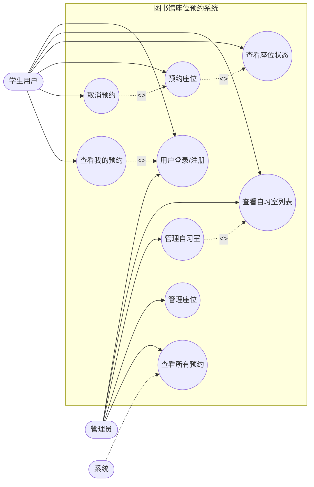
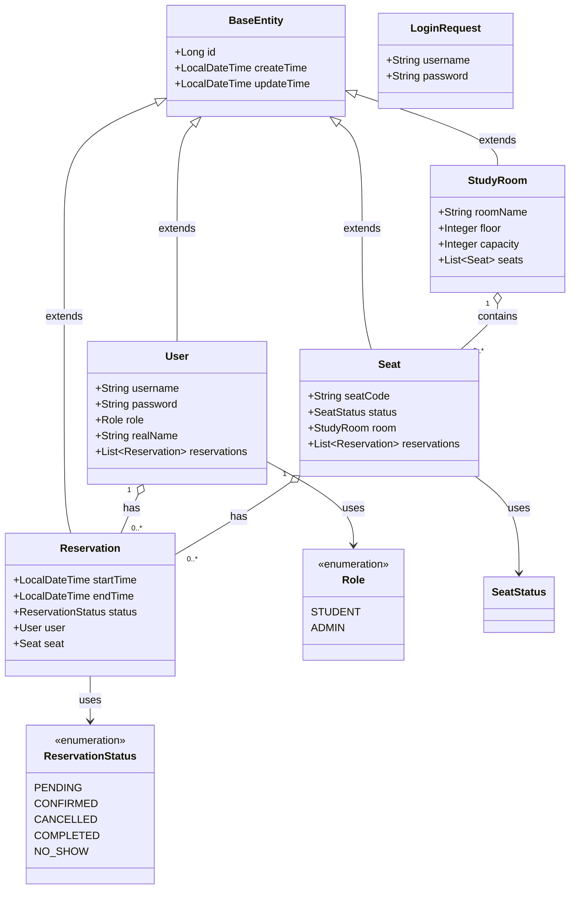
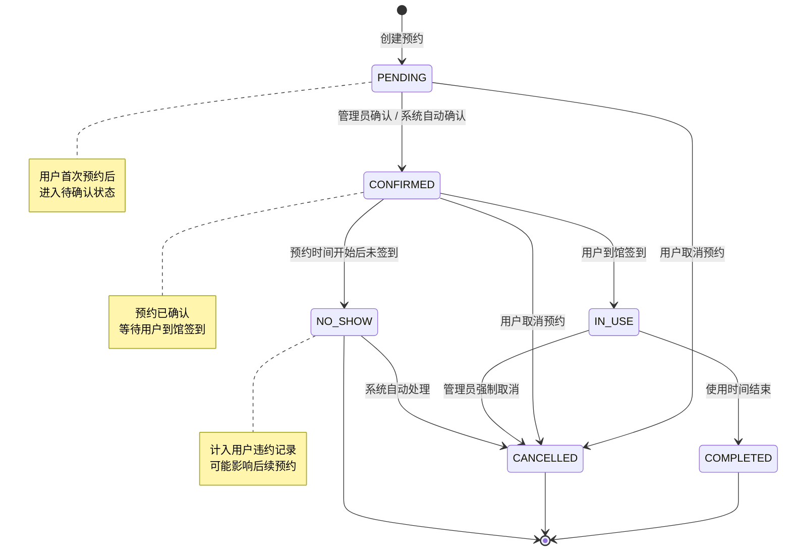

# 图书馆座位预约系统 - UML 图

## 1. 用例图 (Use Case Diagram)

参与者 (Actors):
- **学生用户 (Student)**: 普通注册用户，可预约座位
- **管理员 (Admin)**: 系统管理人员，可管理系统资源
- **系统 (System)**: 后端自动化服务，处理预约状态变更

用例 (Use Cases):
1. UC1: 用户登录/注册
2. UC2: 查看自习室列表
3. UC3: 查看座位状态
4. UC4: 预约座位
5. UC5: 取消预约
6. UC6: 查看我的预约
7. UC7: 管理自习室 (管理员)
8. UC8: 管理座位 (管理员)
9. UC9: 查看所有预约记录 (管理员)

关系:
- `<<include>>`: UC4(预约座位) includes UC3(查看座位状态)
- `<<include>>`: UC6(查看我的预约) includes UC1(用户登录)
- `<<extend>>`: UC5(取消预约) extends UC4(预约座位) - 在预约后可以取消
- `<<extend>>`: UC7(管理自习室) extends UC2(查看自习室) - 管理员可管理

---

## 2. 类图 (Class Diagram)

实体类:
1. **User** - 用户类
2. **StudyRoom** - 自习室类
3. **Seat** - 座位类
4. **Reservation** - 预约类
5. **BaseEntity** - 基础实体类 (抽象父类)
6. **LoginRequest** - 登录请求DTO
7. **ReservationStatus** - 预约状态枚举

关系:
- User 1:N Reservation
- StudyRoom 1:N Seat
- Seat 1:N Reservation
- BaseEntity <|-- User, StudyRoom, Seat, Reservation (继承)
- Reservation 使用 ReservationStatus (依赖)

---

## 3. 状态图 (State Diagram) - 预约状态转换

以 **Reservation (预约)** 对象的状态转换为例:

状态:
1. **PENDING** - 待确认
2. **CONFIRMED** - 已确认
3. **IN_USE** - 使用中
4. **COMPLETED** - 已完成
5. **CANCELLED** - 已取消
6. **NO_SHOW** - 违约

---

## 关系说明

### 用例图关系说明
| 关系类型 | 描述 |
|---------|------|
| `<<include>>` | 预约座位必须先查看座位状态 |
| `<<include>>` | 查看我的预约必须先登录 |
| `<<extend>>` | 取消预约是预约功能的扩展 |
| `<<extend>>` | 管理自习室是查看功能的扩展 |

### 类图关系说明
| 关系类型 | 描述 |
|---------|------|
| 继承 | BaseEntity 是所有实体的父类，提供公共字段 |
| 1:N 关联 | User → Reservation (一个用户可有多个预约) |
| 1:N 关联 | StudyRoom → Seat (一个自习室有多个座位) |
| 1:N 关联 | Seat → Reservation (一个座位可有多条预约记录) |
| 依赖 | Reservation 使用 ReservationStatus 枚举 |

### 状态图转换事件
| 转换 | 触发事件 |
|-----|---------|
| PENDING → CONFIRMED | 管理员确认 或 系统自动确认 |
| PENDING → CANCELLED | 用户取消 |
| CONFIRMED → IN_USE | 用户到馆签到 |
| CONFIRMED → NO_SHOW | 预约时间开始后未签到 |
| CONFIRMED → CANCELLED | 用户取消 |
| IN_USE → COMPLETED | 使用时间结束 |
| IN_USE → CANCELLED | 管理员强制取消 |
